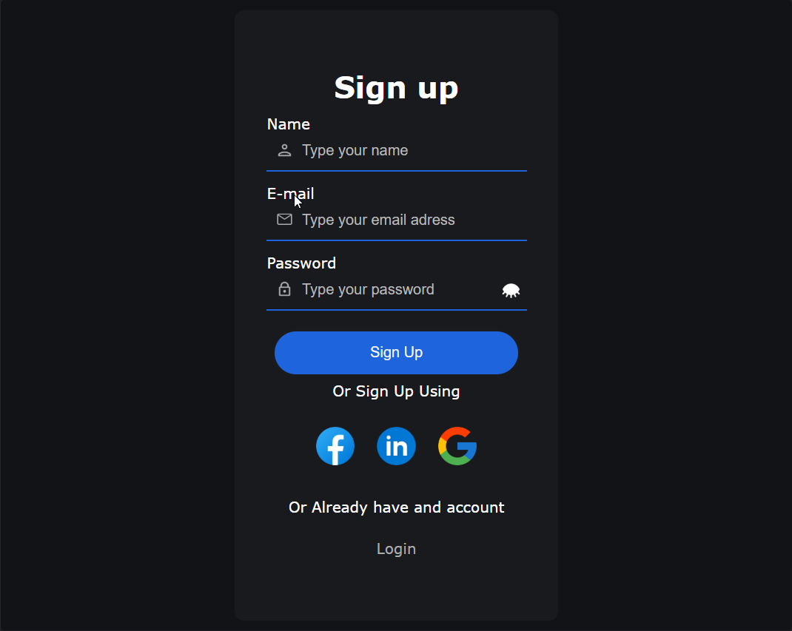

# Signup System

A small Flask signup application with a browser frontend, JSON communication, server-side validation, bcrypt password hashing, and SQLite persistence. The frontend currently has separate JavaScript files for the signup and login pages.



## Features

- Signup form served from the frontend
- JSON requests from JavaScript to Flask
- Pydantic validation for username, email, and password
- Additional backend username validation
- Bcrypt password hashing before storage
- SQLite database access through `aiosqlite`
- CORS configuration for local frontend development
- Helpful HTTP responses for successful and invalid requests
- Separate `signup.js` and `login.js` page scripts
- Shared signup form styling used by both pages

## Project Structure

```text
.
├── db/
│   ├── database.py
│   └── userDB.db
├── src/
│   └── signup.png
├── static/
│   ├── login.js
│   ├── signup.css
│   └── signup.js
├── templates/
│   ├── login.html
│   ├── signup.html
│   └── index.html
├── main.py
├── schema.py
└── README.md
```

## Requirements

- Python 3.12 or later
- Flask
- Flask-CORS
- Pydantic
- `pydantic[email]`
- bcrypt
- aiosqlite
- Rich

## Installation

Create and activate a virtual environment:

```powershell
python -m venv .venv
.\.venv\Scripts\Activate.ps1
```

Install the dependencies:

```powershell
pip install Flask[async] flask-cors pydantic[email] bcrypt aiosqlite rich
```

## Run the Backend

From the project directory:

```powershell
python main.py
```

The Flask backend runs at:

```text
http://localhost:8080
```

The current Flask routes include `/`, `/index`, `/signup` (POST), `/login` (POST), and `/user`. The HTML signup and login pages do not currently have Flask GET routes, so they should be opened through the frontend server described below.

## Run the Frontend

Serve the project with a local web server such as VS Code Live Server. Open the pages from the URL provided by that server, commonly:

```text
http://127.0.0.1:5500/templates/signup.html
```

The login page is commonly available at:

```text
http://127.0.0.1:5500/templates/login.html
```

The templates currently reference assets with paths such as `../static/signup.js` and `../static/signup.css`. If the assets are moved into nested folders, keep the path relative to the template location when using Live Server. For example:

```text
static/
├── css/
│   └── signup.css
└── js/
  └── signup.js
```

```html
<link rel="stylesheet" href="../static/css/signup.css">
<script src="../static/js/signup.js" defer></script>
```

When a template is rendered by Flask instead, use Flask's `url_for` helper:

```html
<link rel="stylesheet" href="{{ url_for('static', filename='css/signup.css') }}">
<script src="{{ url_for('static', filename='js/signup.js') }}" defer></script>
```

The frontend sends signup data to:

```text
POST http://localhost:8080/signup
```

The backend currently allows these local frontend origins:

- `http://localhost:5500`
- `http://127.0.0.1:5500`

The origin must match the browser URL exactly. `localhost` and `127.0.0.1` are different origins.

## API Example

Request:

```http
POST /signup
Content-Type: application/json
```

```json
{
  "username": "example_user",
  "email": "user@example.com",
  "password": "a-strong-password"
}
```

Successful response:

```json
{
  "message": "User created successfully"
}
```

The response uses HTTP status `201 Created`.

Invalid data returns HTTP status `400` with an error message.

## Security Notes

- Passwords are hashed with bcrypt before being stored.
- Passwords should never be returned to the frontend or written to logs.
- Backend validation is the security boundary; frontend validation only improves user experience.
- The Flask development server is intended for local development, not production.
- Before deployment, use a production server, HTTPS, secure secret management, rate limiting, and stronger database error handling.
- The SQLite database file is local development data and should not be committed to GitHub.

## Current Status

The signup flow is implemented with client-side validation, a page-specific `signup.js` file, and a JSON `POST /signup` request. The login page has its own `login.js` file, but the login endpoint and login submission behavior are not implemented yet. Sessions, cookies, logout, automated tests, and production deployment are planned next.

## Future Improvements

- Implement login submission and authentication
- Add a dedicated `login.css` file if login-specific styling is needed
- Add Flask GET routes for the signup and login pages
- Add secure session cookies
- Add duplicate-user error responses such as `409 Conflict`
- Add automated backend and frontend tests
- Improve user-facing success and error messages
- Move documentation images to `docs/images/` if the project grows
